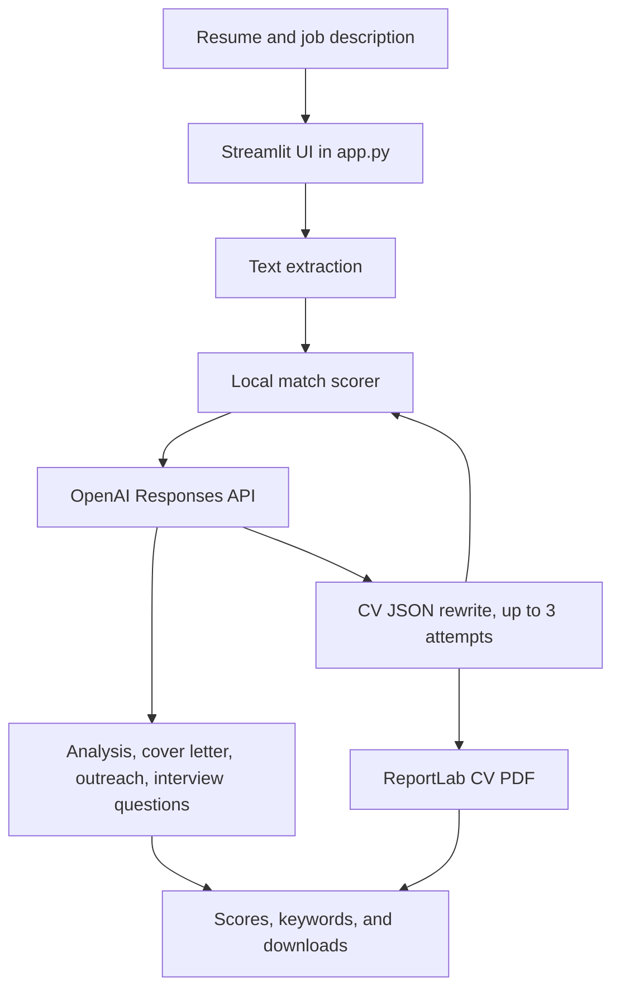

# AI Job Application Assistant

A Streamlit app that scores a resume against a job description and uses the OpenAI API to draft an updated CV, a tone-selectable cover letter, recruiter outreach, and interview preparation.

Built by [Md Tanvir Mannan](https://github.com/Santo250499) as a portfolio project while moving from IT support into AI and automation roles.

Repository: https://github.com/Santo250499/ai-job-application-assistant

## Problem

Each application asks for the same set of materials, rewritten for a different job description: a CV, a cover letter, a short note to a recruiter, and answers you can use in an interview. Doing that by hand is slow. Handing the whole task to a model, with no local check, also makes it hard to see why a resume matches or misses a role, especially for Australian applications where location, work rights, and straightforward CV structure matter.

## Solution

The app reads a resume and a job description, scores the match with rules written in Python, and sends that context to OpenAI. The model writes an analysis, a cover letter in a tone you choose, a LinkedIn message and a hiring-manager email, and interview questions. It also rewrites the CV into structured JSON. The app scores each rewrite locally, keeps the strongest result from up to three attempts, and turns it into a PDF you can download.

The prompts require Australian English and tell the model to use only details supported by the original resume: employers, dates, qualifications, certifications, work rights, and numbers.

## Features

- Upload a resume and a job description as PDF, DOCX, or TXT, or paste either text into the page. Uploaded text is used for scoring and generation and is not shown back on the page.
- Set a target role, an Australian target location, work rights or visa status, and career level.
- Score the original resume from 0 to 100 and label it with a match band.
- Show matched keywords and keywords that are still missing or weak. The missing list is a prompt to add them only when they are true.
- Ask OpenAI for a structured analysis: match assessment, score explanation, strongest points, weak areas, Australian job-market advice, resume suggestions, keywords to strengthen, and what to fix first.
- Write a cover letter in one of five tones: Professional, Confident, Friendly, Formal, or Short and Direct.
- Write a LinkedIn recruiter message and a separate email to a hiring manager.
- Write interview preparation: role-specific questions, behavioural questions, Australian workplace communication questions, and a short interview strategy. Each question includes a short answer tip.
- Rewrite the CV up to three times, aiming for a local score of 80 out of 100, and download the best version as `ready_updated_cv_australia.pdf`.
- Compare the original score with the updated CV score, including keyword alignment, structure, achievements, ATS quality, and Australian market fit.
- Download the analysis, cover letter, recruiter outreach, and interview questions as text files.
- Stop on startup with a clear error if `OPENAI_API_KEY` is missing.

## Tech stack

| Piece | Role in this project |
| --- | --- |
| Python | Application language |
| [Streamlit](https://streamlit.io/) | Web UI, file upload, settings, results, and downloads |
| [OpenAI API](https://platform.openai.com/) | Text generation through the Responses API. `app.py` calls the `gpt-4.1-mini` model |
| python-dotenv | Loads `OPENAI_API_KEY` from a local `.env` file |
| pypdf | Reads uploaded PDF files |
| python-docx | Reads uploaded DOCX files |
| ReportLab | Builds the updated CV PDF |

`requirements.txt` lists those third-party packages and nothing else. The standard-library modules used by `app.py` (`os`, `re`, `json`, `html`, and `io`) are not pinned there.

## How it works

1. You attach or paste a resume and a job description, then set the target role, location, work rights, career level, and cover letter tone.
2. PDF, DOCX, and TXT files are converted to plain text in the app. TXT is decoded as UTF-8.
3. A local scorer compares the resume with the job description. It does not call the API.
4. On **Analyse & Generate Ready CV PDF**, the app sends the resume, job description, score breakdown, and settings to OpenAI.
5. One call writes the analysis, one writes the cover letter, one writes the LinkedIn message and hiring-manager email, and one writes the interview questions.
6. A separate call asks for an updated CV as JSON. If the JSON cannot be parsed, that call is retried up to three times. The parsed CV is scored again with the same local rules.
7. If the updated score is under 80, the app tries again with feedback about the missing keywords, up to three rewrite attempts in total. It keeps the highest-scoring CV.
8. ReportLab renders that CV to PDF. Scores, keywords, and the four text outputs stay in the Streamlit session until you run the analysis again.

### Match score

The total is capped at 100. The parts below are the maximum each check can contribute.

| Check | Maximum | What it looks at |
| --- | --- | --- |
| Keyword alignment | 45 | Overlap between job-description keywords and the resume |
| Resume structure | 15 | Headings such as summary, experience, education, skills, and projects or certifications |
| Achievement evidence | 10 | Numbers and action verbs in the resume |
| ATS quality | 15 | Contact details, bullet-style lines, and resume length |
| Australian market fit | 15 | Location and work-rights signals, plus the location and work-rights options you select |

Match bands in the app are Excellent Match (85+), Target Score Reached (80+), Strong Match (72+), Moderate Match (58+), Possible Match (45+), and Needs Major Improvement below that.

The keyword list used by the scorer includes general hiring terms and a large set of IT support terms (service desk, Microsoft 365, Active Directory, networking, and similar). That reflects the roles this project was written to practise on.

## Architecture overview



Everything in the current version lives in `app.py`. Parsing, scoring, prompts, PDF layout, and the page are separate functions in that file.

```text
.
├── app.py
├── requirements.txt
├── .env.example
├── .gitignore
└── .devcontainer/devcontainer.json
```

## Installation

```bash
git clone https://github.com/Santo250499/ai-job-application-assistant.git
cd ai-job-application-assistant
python -m venv .venv
```

Activate the virtual environment:

```bash
# macOS and Linux
source .venv/bin/activate

# Windows
.venv\Scripts\activate
```

Install dependencies:

```bash
pip install -r requirements.txt
```

The dev container in `.devcontainer/devcontainer.json` uses Python 3.11, installs `requirements.txt`, and can start the app on port 8501. Local setup above is enough to run the project yourself.

## Setup and configuration

Copy the example environment file and add your own key:

```bash
cp .env.example .env
```

`.env.example` lists every variable the code reads:

| Variable | Required | Purpose |
| --- | --- | --- |
| `OPENAI_API_KEY` | Yes | Passed to the OpenAI client after `load_dotenv()` |

`app.py` does not read any other environment variable. Leave the key only in `.env`. That file is gitignored. `.env.example` holds a placeholder and is safe to commit.

When you click the analyse button, the resume text and job description are included in the prompts sent to OpenAI. The page does not display that extracted text, but the API request does contain it. Use a key and account you are willing to send that content through.

## How to run

From the project directory, with the virtual environment active and `.env` in place:

```bash
streamlit run app.py
```

Streamlit serves the app at [http://localhost:8501](http://localhost:8501).

## Screenshots

Screenshots are not in the repository yet. Add image files under `docs/screenshots/` and link them in this section. Useful shots to capture:

- The input page with a resume, a job description, and the application settings
- The match dashboard with the original score, updated score, and keyword tags
- The analysis, cover letter, recruiter outreach, and interview question tabs

## Future improvements

- Split `app.py` into modules for file parsing, scoring, OpenAI prompts, PDF generation, and the Streamlit layout.
- Add tests for keyword extraction, the score breakdown, and JSON cleanup.
- Pin versions in `requirements.txt`.
- Add the screenshots described above.
- Make the OpenAI model name configurable instead of hardcoding `gpt-4.1-mini`.

## What I learned

I came to this project from IT support, and I used a job-application workflow I already knew as the product to build. The useful part was keeping the match score in Python. The breakdown is something I can explain, and the model is asked to improve a CV against that score rather than being the only judge of quality. I also learned how much of a small AI app is ordinary software: reading PDF and DOCX files, holding results in session state, and rendering a PDF with ReportLab. The tone dropdown and the Australian work-rights fields taught me to put the choices I care about in the interface, then pass them into the prompt, instead of hoping a single generic request would cover them.

## GitHub

https://github.com/Santo250499/ai-job-application-assistant
